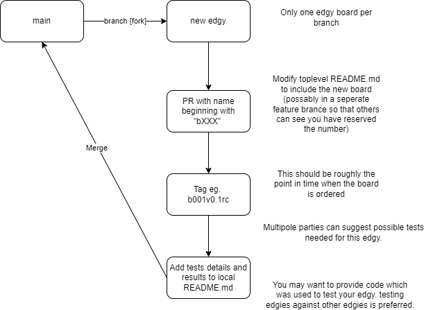

# Decompose all the things!
the philosophy behind this 'things_on_edge' project is to decompose electronic circuits into their basic blocks with standardized connections between them. The goal is to allow reuse of as many parts of the design as possible such that only the novel pieces require effort. In this repository you will find a growing collection of small basic circuits, also known as 'edgy boards', which can be connected together using [put_on_edge](https://github.com/skunkforce/put_on_edge) connectors.

# contributing

# contents by category
## Ethernet
### Switches 
**b034** 5 port switch using KSZ8895

**Status:** on hold untill the chips are availible.

**b035** 7 port gigabit switch using KSZ9477

**Status:** abandoned untill the chips are availible again.

**b042** 7 port gigabit switch using KSZ9897

**Status:** abandoned untill the chips are availible again.

### Connectors
**b004** 100BASE-T connector featuring a Würth 7499211121A RJ45 connector with builtin magnetics and PoE rectifier.

**Status:** tested. 

**b010** 1000BASE-T connector featuring a Würth 615008145521 RJ45 connector.

**Status:** potential problem with 009 pinning.

**b038** 1000BASE-T connector featuring Würth 7499111121A RJ45 connector.

**Status:** review needed.

**b039** gigabit SGMII cage.

**Status:** review needed.

### Magnetics
**b009** 1000BASE-T magnetics in phy to device configuration featuring WE7490220122.

**Status:** potential problem with 009 pinning.

**b060** 1000BASE-T magnetics in extractor/injector configuration featuring WE7490220122.

**Status:** ordered.

### Phys
**b007** 100Mbit PHY featuring LAN8742A

**Status:** tested with b004.

**b008** 100Mbit PHY featuring KSZ8081RND

**Status:** not finished.

**b037** gigabit phy using KSZ9031

**Status:** abandoned untill the chips are availible again.

**b040** gigabit phy using DP83822

**Status:** abandoned untill the chips are availible again.

**b041** gigabit phy ad RMII master using DP83822

**Status:** abandoned untill the chips are availible again.

**b040** gigabit phy using DP83848

**Status:** abandoned untill the chips are availible again.

### Bridges
**b016** 100Mbit usb to ethernet bridge.

**Status:** ordered.

### PoE
**b011** PoE++ Rectifier using LT4321

**status:** ordered, not tested.

**b012** PoE Rectifier using MB10FTR

**status:** ordered, not tested.

**b027** PoE++ PD using LT4275

**b029** PoE++ PSE using LTC4266

**b033** PoE PD with flyback DCDC

**Status:** on hold untill chips are availible again.

**b076** PoE PD with flyback DCDC using SI3404

**Status:** ordered.

**b076** PoE PD with buck DCDC using MP8007

**Status:** ordered.

## USB
**b006** 4 port USB hub featuring GL850G.

**Status:** tested.

**b017** USB to debug edge using FT2232

**Status:** ordered.

**b021** USB to I2C host using FT260S

**Status:** unfinished.

**b022** USB to I2C device using FT201XS

**Status:** ordered.

**b051** USB C connector

**Status:** tested.

## 1-wire
**b043** 1wire to I2C bridge using DS28E18

**Status:** ordered, not tested.

**b044** 1wire to SPI bridge using DS28E18

**Status:** ordered, not tested.

**b045** 1wire to RJ45 connector

**Status:** review needed.

**b048** I2C 1wire master DS2484R

**Status:** review needed.

## CAN
**b087** CAN controller with SPI interface featuring MCP2515

**status** initial design.

### FD
**b065** CAN FD controller with SPI interface featuring MCP2517FD

**status** ordered.

**b066** CAN FD transceiver featuring TJA1441

**status** ordered.

## Regulator
### Switching
**b063** Isolated 5v-5v DCDC.

**Status:** ordered.

**b025** USB to 4x DCDC 

**Status:** tested.

**b025** 4.5V to 75V buck converter MAX17760

**Status:** needs review.

### LDO
**b002** features a TCR2EF33 producing 3.3V output from a 5 volt input. 

**Status:** tested

## Microcontroller
**b018** breakout of the RP2040

**Status:** [b018v2.2rc ordered](https://github.com/skunkforce/things_on_edge/releases/tag/b018v2.2rc)

**b019** breakout of the STM32F042.

**Status:** finished but not ordered (or tested) because STM32F042 is out of stock.

**b023** breakout of the STM23F723IE

**Status:** outdated and probably dorment untill the chips are availible again.

**b026** breakout of STM32F7 144 pin TQFP

**Status:** outdated and probably dorment untill the chips are availible again.

**b030** breakout of STM32F7 100 pin TQFP

**Status:** outdated and probably dorment untill the chips are availible again.

**b032** breakout of STM32F7 100 pin TFBGA

**Status:** outdated and probably dorment untill the chips are availible again.

**b028** STM32F042 with just one I2C connector.

**Status:** abandoned.

**b020** STM32F745 breakout.

**Status:** abandoned untill the chip is availible again.

**b053** STM32F107 64TQFP breakout.

**Status:** abandoned untill the chip is availible again.

## system on a module
**b049** Raspberry Pi compute module 4 with isolated flyback PoE. 

**Status:** this board is essentially a composition of b076, b080 and a CM4. development of this is paused untill those are fully tested.

## Pinconnectors
**b003** generic jumper pins on a pass through connector.

**b005** generic pin sockets on a pass through connector.

**b014** ADC to SMA

**status:** tested. 

## ADC
**b013** ADS868x

**status:** ordered, not tested.

**b031** ADS8688 8X differential SPI ADC

**status:** tested.

**b056** ADS8160 8X differential SPI ADC

**status:** review needed.

**b056** ADS131M08 8X differential SPI ADC

**status:** ordered.

## DAC
**b024** 4x DAC with I2C interface using MCP4728.

**Status:** ordered, not tested.

## Isolators
**b036** I2C isolator featuring ADUM1251

**Status:** ordered, not yet tested.

**b055** SPI isolator and DCDC featuring ADUM5411

**Status:** unfinished.

## Memory
**b046** I2C eeprom M24C02

**Status:** test needed.

## Sensors
### hall effect

**b015** MLX91205.

**status:** not finished.

**b047** HDC1080.

**status:** review needed.

## Analog
**b050** analog preamp using LMV601

**Status:** review needed.

## Other
**b058** RTC MCP79410

**Status:** review needed.

